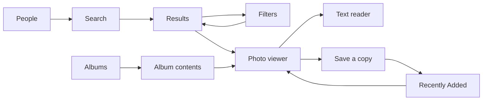

# Course requirements and demonstration

This audit covers the supplied requirements and marking table below. The implementation-related
criteria total **90 points**; report/presentation/collaboration account for the remaining 10 points
and are outside this code review. Meeting a criterion is evidence for assessment, not a guaranteed
score: originality, suitability for group size and performance on the assessor's device need judgment.

## Implementation assessment

| Criterion | Weight | Code evidence and refinements |
| --- | --- | --- |
| Functional completeness | 30% | Real text/image/combined search, OCR, saved face references, albums, reading text, sharing, deleting and saving copies. Index stages persist independently. OCR and visual results become available photo by photo. Failed images and storage operations have recovery paths. |
| Technical quality | 25% | Compose → ViewModel → repository/AI → Room/MediaStore separation; cancellable asynchronous work; explicit Room migrations; Android runtime/partial permissions; incremental WorkManager tasks. Search navigation survives activity recreation, drafts use saved state, and stale inference cannot overwrite a newer indexed revision. |
| UI and UX | 20% | Eight connected screens, two clear query tabs, adaptive grids, landscape viewer with scrollable actions, pinch/double-tap zoom, light/dark themes, loading/empty/error/queued states, settings recovery after denied permissions, and confirmation before removing a saved person. Filter cancellation and state restoration are covered by UI tests. |
| Originality and complexity | 15% | Combines offline cross-modal retrieval, independently matched `@people`, Vietnamese accent-insensitive OCR/FTS, local persistence and Android media actions. This is substantial implemented functionality; provenance and suitability for the actual group size cannot be established by automated checks. |

No missing feature was identified against the explicitly supplied implementation requirements.
This does **not** assert defect-free operation on every Android device or perfect model accuracy.
Validation results and the remaining practical limits are recorded below.

## Required application capabilities

| Supplied requirement | Implementation and evidence | How to demonstrate |
| --- | --- | --- |
| At least 3–4 meaningfully connected screens | Eight distinct screens: Search, Results, Filters, People, Albums, Album contents, Photo viewer, Text reader. See [navigation](app/src/main/java/com/example/mobile_image_retrieval/MainActivity.kt). Loading and permission views are additional states, not counted as separate feature screens. | Follow the search → results → photo → text-reader flow; use Filters to change a real query. |
| Persistent local data | Room schema 4 stores image/face embeddings, OCR text/indexes, saved people, search history and indexing progress in `photo-search.db`. [Database](app/src/main/java/com/example/mobile_image_retrieval/data/db/PhotoSearchDatabase.kt), [DAOs](app/src/main/java/com/example/mobile_image_retrieval/data/db/Daos.kt). | Save a person and run a query, close/reopen the same installation, and show the retained person/history/progress. |
| External data source or device capability | Android MediaStore queries actual device photos; system photo picker grants image access; the share sheet opens compatible apps; save-copy publishes a real image; delete uses Android confirmation when required. [Library](app/src/main/java/com/example/mobile_image_retrieval/data/mediastore/MediaStoreRepository.kt), [copy writer](app/src/main/java/com/example/mobile_image_retrieval/data/mediastore/PhotoCopyRepository.kt). | Import/select real photos, open an album, share a result, and save a copy to `Pictures/Photo Search`. This is device integration; a REST API is not required by the supplied wording. |
| Permitted Android stack | Kotlin, Jetpack Compose, Android SDK, ViewModel/StateFlow, Navigation Compose, Room and WorkManager. | Inspect [app configuration](app/build.gradle.kts) and the source. |
| Native-installable Android product | Gradle builds a signed debug APK for Android 10+ (`minSdk 29`). Local OCR, CLIP and face models are bundled in the assembled APK. | Install `app/build/outputs/apk/debug/app-debug.apk` and launch it independently of Android Studio. |

## Connected user flows



## Suggested demonstration

1. Install the APK **over the existing installation** (`adb install -r`) to preserve data.
   Choose a small set of photos containing a scene, a clear face, and a legible Vietnamese bill
   or message screenshot. Allow indexing to finish before demonstrating search ranking.
2. Show **Albums → album contents → photo viewer**. These load directly from device storage.
3. In **Normal query**, search using text, then an image, then both. Open a result.
4. Open **Filters**, apply a relevant date range/sort, and show the resulting query update.
5. In **People**, save one clear face with a name, then search with its `@handle`.
6. In **OCR search**, search text actually present in a photo; demonstrate both `hóa đơn`
   and `hoa don`. Open the result, choose **Read text**, and copy recognized text.
7. In the viewer, tap **Save a copy**. Use **View** to open it in **Recently Added**. The
   new file is stored in `Pictures/Photo Search`; the original remains available.
8. Close/reopen the app. Show saved people, history, and retained indexing progress.
   Unchanged completed scans are reused; unfinished work resumes. Uninstalling/clearing data
   intentionally removes the app's private database.

## Build and validation

```text
gradlew.bat :app:assembleDebug :app:testDebugUnitTest :app:lintDebug
```

Instrumentation covers Room migrations and stale-revision protection, search modes, real bundled
OCR/face/CLIP inference, Vietnamese keyboard composition, photo-copy success/failure paths,
filter restoration/cancellation, zoom and viewer actions on a short landscape layout. Use a dedicated test
emulator when possible. The project retains installed APKs after connected tests to avoid
erasing a development photo index during cleanup.

### Verified on 5 September 2026

| Check | Result |
| --- | --- |
| Debug APK build | Passed; all four ONNX assets are bundled uncompressed. Universal debug APK: 502,532,800 bytes. |
| JVM unit tests | 63 passed, 0 failures. Includes OCR chronological limits across multiple pages and deterministic ties. |
| Android instrumentation | 40 passed, 0 failures on the Android 16 / API 36.1 emulator. |
| Android lint | 0 errors; 21 dependency/API-version and KTX-style warnings. |
| Existing installation | Original install time remained 13:44:26 after the test runs; the private database was retained. |
| Manual app check | Real search results opened in the viewer; rotating retained the selected photo and displayed the landscape layout. After background process termination/relaunch, the `sunset` draft and history returned with 475/475 photos still indexed. |

The checks establish specific working paths, not a statistical recognition benchmark or testing
on every supported phone. A cold visual query on this emulator took about 8.2 seconds including
model initialization; the loading screen remained available. First-load speed and large-library
indexing remain practical limitations of the bundled models.

## Submission considerations

- The submitted APK must contain the model assets. The large CLIP ONNX files are gitignored;
  a source-only clone needs those files supplied separately as documented in [README](README.md).
- First-time indexing can be slow on an emulator or a large library. Demonstrate with a small,
  prepared library; the app shows saved/remaining progress and supports incremental reuse.
- Normal visual descriptions work best in English; Vietnamese is supported for input and OCR.
  OCR can misread blurred/tiny text. Search uses real models, not guaranteed exact recognition.
- Automated tests do not establish retrieval accuracy on the user's full library. Face matches can
  be mistaken, OCR can miss text, and normal visual descriptions work best in English.
- This review excludes the report/video and individual contribution assessment as requested.

## Supplied marking table

| No. | Criterion                            | What is assessed                                                                                                                                                                                                                | Weight |
| --- | ------------------------------------ | ------------------------------------------------------------------------------------------------------------------------------------------------------------------------------------------------------------------------------- | ------ |
| 1   | Functional completeness              | The app installs and runs reliably on Android; the features described in the report are all implemented; no critical defects such as crashes, freezes, or data loss                                                             | 30%    |
| 2   | Technical quality & source code      | Sound architecture with clear separation of UI, logic, and data; correct application of course techniques (lifecycle handling, local storage, API calls, asynchronous work, runtime permissions); readable, well-organised code | 25%    |
| 3   | User interface & user experience     | Intuitive and consistent UI; sensible navigation; adapts to different screen sizes; handles loading, empty, error, and offline states gracefully                                                                                | 20%    |
| 4   | Originality & complexity             | A practical idea with a creative element; difficulty appropriate to the group size; not a copy of an existing template or tutorial project                                                                                      | 15%    |
| 5   | Report, presentation & collaboration | Complete, well-structured report; clear demo video and coherent presentation; every member has contributed                                                                                                                      | 10%    | 
