# Mobile Image Retrieval

Private, on-device semantic search over the user's Android photo library. The app is Kotlin/Jetpack Compose, targets Android 10+ (`minSdk 29`), never uploads media, and does not request `INTERNET` permission.

## Architecture

The app uses a small MVVM/repository structure:

- `ai/`: MobileCLIP2-S0 semantic search, SCRFD face detection, MobileFaceNet recognition, alignment, normalization, and exact Top-K search.
- `data/mediastore/`: real `MediaStore` metadata and thumbnail access.
- `data/db/`: Room entities, DAOs, and Float32 embedding codec.
- `data/repository/`: search/history coordination and incremental-index planning.
- `worker/`: resumable WorkManager indexing.
- `ui/`: StateFlow ViewModel, Compose screens, navigation, and theme.

```mermaid
flowchart TD
    MS[Android MediaStore] -->|content URI| TH[loadThumbnail 256 x 256]
    TH --> PRE[Exporter-verified preprocessing]
    PRE --> IE[Persistent MobileCLIP2-S0 image ONNX session]
    IE --> N1[L2-normalized 512-D vector]
    N1 --> DB[(Room: metadata + Float32 embedding)]

    Q[Natural-language query] --> TOK[Exporter-verified CLIP tokenizer]
    TOK --> TE[Persistent MobileCLIP2-S0 text ONNX session]
    TE --> N2[L2-normalized 512-D vector]
    N2 --> SCAN[Bounded-page exact dot-product scan]
    DB --> SCAN
    MS --> FD[Bounded photo decode and SCRFD detection]
    FD --> FA[Five-point alignment and MobileFaceNet]
    FA --> FDB[(Room: per-face vectors and index version)]
    P[Saved @people face vectors] --> MATCH[Distinct face match for every person]
    FDB --> MATCH
    MATCH -->|filter before ranking| SCAN
    SCAN --> TOPK[Bounded Top-K heap]
    TOPK --> UI[Compose grid of real content URIs]
```



## Indexing pipeline

`PhotoIndexWorker` queries accessible images newest-first. It compares each current `mediaId/dateModified` pair with Room:

- new: embed and insert;
- unchanged: skip semantic inference; backfill faces if the face index is missing or from an older model;
- modified: embed and replace;
- deleted: remove its Room row.

The worker persists each successful item immediately, so process death does not discard earlier work. One worker handles the controlled sequence; there is no task or coroutine per photo. A bad thumbnail is logged and skipped without terminating the library pass. WorkManager uses a battery-not-low constraint but does not require charging or networking.

Semantic indexing uses `ContentResolver.loadThumbnail(uri, Size(256, 256), ...)`. Face indexing separately decodes an EXIF-oriented version of the original with a longest side of at most 1280 pixels, preserving the full frame, and runs a 640×640 detector followed by sequential 112×112 face recognition. Each bitmap is recycled before continuing to the next photo. Photos with no faces receive a completion marker so they are not reprocessed on every pass. Face rows and completion markers are replaced atomically and cascade away when the parent photo is removed or replaced.

## MobileCLIP2-S0 integration

Place assets under `app/src/main/assets/models/`:

1. `mobileclip2_s0_image.onnx`
2. `mobileclip2_s0_text.onnx`
3. `mobileclip2_s0_config.json`
4. tokenizer vocabulary and merges files named by the config

The image and text graphs must come from the same MobileCLIP2-S0 checkpoint and both output exactly 512 Float32 values. Each session is initialized lazily once and retained for the application process. Image and text inference are individually serialized with a `Mutex` until device profiling justifies safe parallelism.

The config is generated alongside the graphs and is the runtime contract. Its top-level structure is:

```json
{
  "format_version": 1,
  "model": { "name": "MobileCLIP2-S0", "embedding_dimension": 512 },
  "image_encoder": {
    "input_name": "pixel_values",
    "output_name": "image_embedding",
    "layout": "NCHW",
    "image_size": 256,
    "preprocessing": {
      "resize_mode": "shortest",
      "interpolation": "bicubic",
      "center_crop": true,
      "divide_uint8_by_255": true
    }
  },
  "text_encoder": {
    "input_name": "input_ids",
    "output_name": "text_embedding",
    "input_dtype": "int64",
    "context_length": 77
  },
  "tokenizer": { "type": "open_clip_simple_tokenizer" },
  "tokenizer_test_vectors": []
}
```

This excerpt omits additional required fields; `mobileclip2_s0_config.json` is the complete schema. `MobileClipModelConfig` validates graph shapes/types, preprocessing, tokenizer metadata, and generated token-ID vectors. `MobileClipPreprocessor` performs the declared shortest-edge bicubic resize and center crop, and `MobileClipTokenizer` implements the declared OpenCLIP byte-BPE pipeline. Graph inputs and embedding outputs are checked against ONNX Runtime before inference. If an export renamed the configured output, the runtime accepts only a unique Float32 output with shape `[1 or dynamic batch, 512]`; ambiguous or incompatible outputs report the available names and shapes. Missing or inconsistent assets produce a visible error; no random vector, MobileNet, or alternate CLIP fallback exists.

The exported graph contract is strict: image input is Float32 NCHW and text input is Int64 token IDs with no attention-mask input. Both outputs are Float32 512-D embeddings.

## Vector storage and search

### Image search and saved people

On Search, choose **Search by image**, select a reference photo, optionally add a description, and tap **Search**. You can also open a library or result photo and tap **Find similar photos**. The image is encoded with the same MobileCLIP2-S0 model as the library. Filters keep the reference image when rerunning the search. Remove the reference with the close button to return to text-only search. Image queries are session-only and are not added to text search history.

Open **People → Add person**, select one clear photo, and save a name such as `Alex` or `Mai Anh`. The corresponding handles are `@alex` and `@mai_anh`. Names accept 1–40 Unicode letters, numbers, or underscores; spaces become underscores and handles are case-insensitive. Duplicate handles are rejected. Tap a saved handle to search, or type a prompt such as `@alex at the beach`; matching handle suggestions appear while typing. Multiple mentions are supported, and unknown names produce an actionable error. Removing a person deletes their local reference and makes that handle unavailable to future searches.

Saved people persist in Room with a small JPEG thumbnail, a MobileFaceNet face embedding, and its model version; the original picker URI is not needed after saving. Enrollment requires exactly one clear face and rejects no-face, group, and very small/unclear-face photos. **Change face photo** replaces the reference while preserving the person's name and handle. Everything stays on-device. Image selection uses the [Android photo picker](https://developer.android.com/training/data-storage/shared/photo-picker).

For `@alex @mai at the beach`, each identity must match a distinct face above the cosine threshold before the photo is ranked using the CLIP embedding for `at the beach`. People-only queries rank by face similarity. A selected search image can also supply CLIP context, combined equally with text when both are provided. Face embeddings are never averaged across people or mixed into CLIP space. No face inference runs when resolving a saved mention: queries reuse stored vectors.

Database migrations 1 → 2 → 3 preserve the semantic index, history and saved names. Existing whole-photo person references are marked as needing **Update face** in People; they are never silently compared against face embeddings. The next worker pass backfills face data for previously indexed photos. Search and People show progress and warn when results may still be incomplete.

The bundled `det_500m.onnx` and `w600k_mbf.onnx` total approximately 16.1 MB. See [face model provenance, licenses and runtime contract](app/src/main/assets/models/FACE_MODELS.md). The supplied InsightFace weights are for **non-commercial research only**. Matching starts at cosine 0.45; this is an uncalibrated operating point, not a probability. Real-device evaluation is needed for false matches, misses, pose/lighting changes, and small faces in group photos.

Both encoders are L2-normalized. Cosine similarity therefore becomes an allocation-free inner-loop dot product. Search reads Room candidates in pages of 512 and maintains a bounded min-heap, avoiding a full result sort and avoiding loading every embedding object at once. The implementation is isolated behind `SearchCandidateSource`, so another local index could replace it later if profiling warrants it; no HNSW or vector server is included now.

`MediaEmbeddingEntity` stores MediaStore ID, `content://` URI, media type, display metadata, dates, dimensions, bucket data, a Float32 byte array, dimension, and indexing time. It never stores image bytes or filesystem paths. A 512-D vector costs 2,048 bytes, or roughly 20 MB for 10,000 photos before database overhead. `EmbeddingCodec` is the single point for a future explicit FP16 migration.

Search history is another Room table. Insertions trim it to the latest 100 rows; production contains no seeded history. The match percentage shown in detail is a UI-normalized relevance indicator derived from raw cosine similarity. Raw similarity remains stored in `SearchResult`; the percentage is not confidence or probability.

## Permissions and privacy

- Android 13+: requests `READ_MEDIA_IMAGES`.
- Android 14+: also recognizes `READ_MEDIA_VISUAL_USER_SELECTED` and displays a partial-access state.
- Android 10–12L: requests `READ_EXTERNAL_STORAGE`.
- Video permission is not requested because v1 indexes images only.

Denied, partial, and revoked access are handled in UI. Delete uses the MediaStore system confirmation flow where required. The app contains no ads, analytics, telemetry, cloud inference, remote database, or `INTERNET` permission. Android backup is disabled for the local index and search history.

Albums load directly from MediaStore independently of semantic indexing. The library refreshes on resume, when opening Albums, and when MediaStore reports changes while the app is visible. Albums distinguish loading, read failures, and an empty library, with refresh and photo-access controls. Partial access can be expanded from either the search or album screen.

## Build and tests

Open the existing root in a current Android Studio with Android SDK 36 installed, then run:

```text
gradlew.bat :app:assembleDebug
gradlew.bat :app:testDebugUnitTest
gradlew.bat :app:lintDebug
gradlew.bat :app:connectedDebugAndroidTest
```

The last command needs a device/emulator. Tests cover semantic ranking, mention parsing, distinct face assignment, alignment, duplicate-detection suppression, migration and deletion cascades, legacy re-enrollment, enrollment rejection, and combined person/context search. Instrumentation also runs the bundled detector and recognizer against a public-domain portrait at multiple sizes and in a two-face composition, and verifies no-face detection on a blank image.

For a real phone: install the debug APK, grant all or selected photo access, confirm real thumbnails/albums appear, and watch indexing progress. Interrupt/relaunch to verify already persisted vectors are skipped. With verified model assets installed, test in airplane mode, run several natural-language searches, compare relevance/filter ordering, open/share a result, and verify MediaStore deletion requires system consent.

## Current limitations

- The large MobileCLIP2-S0 ONNX graphs are intentionally gitignored. A fresh clone requires the two exporter-validated graph files before semantic indexing/search is available; the generated config and tokenizer assets are included.
- V1 indexes accessible images only. The schema supports `VIDEO`, but representative video thumbnails and `READ_MEDIA_VIDEO` permission are not enabled yet.
- Album rows are real MediaStore buckets and system collections with photo browsing; album editing and “add to album” are not implemented.
- Search is exact and intentionally capped to the top 100 rendered results. This is appropriate for the target 5,000–30,000 items but should be profiled on target hardware.
- Face matching supports explicitly enrolled people. Small, obscured, poorly lit faces can be missed; lookalikes can be confused. Automatic naming/clustering, favorites, scene splitting, frame sampling, and temporal video search are not implemented.

Future work can add a verified accelerated export (LiteRT, ExecuTorch, QNN), configurable thermal/battery policy, FP16 storage migration, representative video indexing, and—only if device profiling demonstrates a need—a replaceable approximate local vector index.
